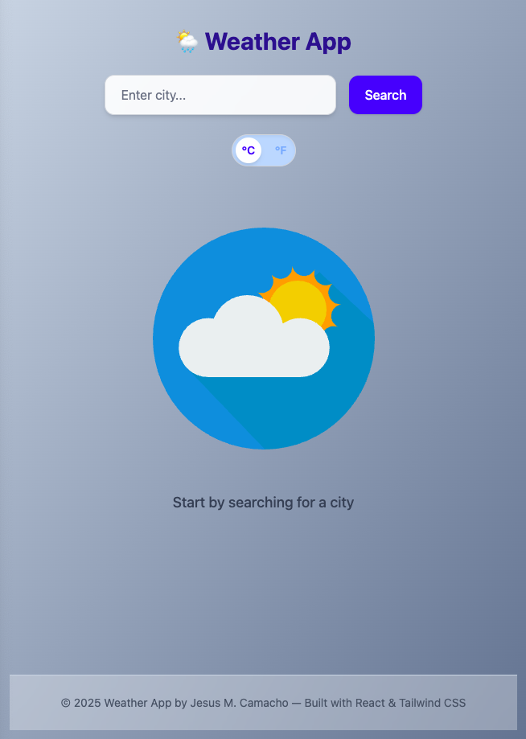

# 🌦️ Weather App

A modern, responsive weather forecast app built with **React**, **Tailwind CSS**, and the **OpenWeatherMap API**. It allows users to search any city and view real-time weather data, including a 5-day forecast, temperature, humidity, wind, visibility, pressure, and more.

## 🚀 Features

- ✅ Real-time weather data by city name
- ✅ Temperature toggle (°C / °F)
- ✅ 5-day weather forecast at 12:00 PM each day
- ✅ Sunrise, sunset, humidity, pressure, wind, cloud coverage, visibility
- ✅ Weather animations using Lottie
- ✅ Responsive and visually polished layout
- ✅ Loading indicators and error handling
- ✅ Clean component structure with React + Tailwind CSS

## 🖼️ Preview

<p align="center">

</p>

## 🛠️ Tech Stack

- **Frontend**: React, Vite
- **Styling**: Tailwind CSS
- **Icons**: lucide-react
- **Animations**: lottie-react
- **API**: [OpenWeatherMap](https://openweathermap.org/)

## 📦 Installation

```bash
git clone https://github.com/jmcg1997/weather-app.git
cd weather-app
npm install
npm run dev
```

> Make sure to create a `.env` file in the root with your API key:
```bash
VITE_API_KEY=your_openweather_api_key
```

## 📁 Project Structure

```
weather-app/
├── public/
├── src/
│   ├── assets/
│   │   ├── animations/
│   │   └── screenshot.png
│   ├── components/
│   │   ├── EmptyState.jsx
│   │   ├── Footer.jsx
│   │   ├── Forecast.jsx
│   │   ├── Loader.jsx
│   │   ├── SearchBar.jsx
│   │   ├── UnitToggle.jsx
│   │   └── WeatherDisplay.jsx
│   ├── App.jsx
│   ├── main.jsx
│   └── index.css
├── .env
├── index.html
└── README.md

```

## 💡 Learnings

- Handling asynchronous API calls with React hooks
- Displaying and formatting real-time weather data
- Responsive design with Tailwind CSS
- Integrating Lottie animations with conditional rendering
- Implementing clean component-based structure

## 📄 License

This project is licensed under the **MIT License**.

---

Feel free to customize the app and add more features like geolocation or hourly forecast!
- 🌍 Geolocation-based weather
- 🕒 Hourly forecasts
- 🌘 Dark mode toggle
- 🔄 Search history